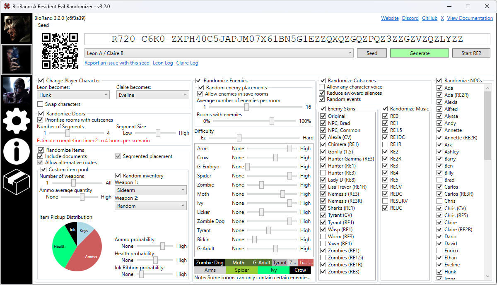

# BioRand: A Resident Evil Randomizer

A new randomizer for the classic Resident Evil games for PC. Supports sophisticated key item placement, randomized non-key items, randomized enemies, randomized NPCs with matching random voices and random background music. All highly configurable and easy to share seeds and configurations.

The randomizer currently only supports the Sourcenext port of Resident Evil 2 with the Classic REbirth patch.
 

## How to use

1. Download the latest release from https://github.com/IntelOrca/biorand/releases.
2. Extract all the files to a directory of your choice.
3. Run `biorand.exe` and type or browse for your RE2 game directory under the generate box. If browsing, select your `bio2 1.10.exe` or `bio2.exe` file.
4. Configure your settings, click `seed` for a random seed and then click generate.
5. Run RE2 and select the mod: "BioRand: A Resident Evil Randomizer" from the list.

## Reporting issues
Please report any bugs, crashes or suggestions by raising an issue on https://github.com/IntelOrca/biorand/issues.
Include the seed you were using in your report.

## Features

### Door randomization

Nearly all doors will be changed to link to different rooms. A graph is constructed to provide an alternative route through the game, key items must still be picked up and doors must still be unlocked.

The randomizer will create 1 to 4 segments that are bridged together with specific rooms (usually bosses). There are options for controlling the number of segments and the average size of a segment. Choosing one segment with the maximum size will generate one very large graph with intertwining rooms, where as 4 segments with a low size will give you a more linear and smaller graph.

The randomizer will also attempt to ensure a room with a box is accessible without needing to pick up any key items from the start or bridge room. Is it possible that some doors will loopback to another room that you could already access. In the cases where there is a loopback to a room where one or more key items were required to loopback, the the door will be locked from the earlier side, thus making it an unlockable shortcut. Doors locked from the inside in the original game may not be locked in a door rando. Depending on the constraints and randomness, some doors may never be connected up and always remain locked.

Not all key items will need to be collected to reach the next bridge room or end, but they may lead to collecting more items such as ammo, ink ribbons, health, or weapons. If a key item is optional for a segment, but is required in a later segment, the key item will be placed again. The amount of usages you get for a key item will depend on how many more times you will need to use it again later in the run, therefore it is safe to discard any item when prompted. A door rando will not ensure enough ammo or weapons are placed before boss rooms, keep this in mind when setting your random item ratios.

If your constraints are too strict, you may get an error for some seeds where it failed to generate a graph that was completable, usually due to the lack of rooms to place items in. If this happens, try another seed or increasing the segment size.
 

### Key item randomization
This randomizer is able to place key items accordingly so that they always appear in a location that can be accessed prior to the door or object that requires the key. Some items crash the game when changing them (such as the locker containing the flamethrower in the lab), and some items do not always spawn in. In the cases where an item isn't always available to pick up, a non-essential item will be placed there (i.e. not a key item or weapon).

There are several options that affect how items are placed:

#### Include documents
Whether or not documents will be replaced with key items or random items. This includes the photos you collect from developing films in the dark room, however the photos will never be key items or weapons due to the fact that, choosing not to pick the item will prevent you from ever picking it up, as you can not develop the film again.

#### Allow alternative routes

This will spawn key items in such a way that you may not be able to unlock doors or use objects in the same order as the original game. For example, in Resident Evil 2, the heart key might be spawned in the main hall, and the spade key might be spawned in the basement. This means you **must** first visit the basement before you can visit the library.

#### Protect from soft lock

This will ensure all key items are placed within an area of the game that is accessible from the door or object that requires the key item. If this is disabled, lab key items can be placed in the police station. The player must therefore be thorough and check every item to make sure all key items are collected before activating any point-of-no-return.

In Resident Evil 2, there are 3 significant points-of-no-return:
* The gate leading to the front of the police station.
* The train / lift transporting you from the marshaling yard to the lab.
* The train platform at the end of scenario B.

BioRand pretends there are two more points-of-no-return:
* The door leading to the sewers
* The cable car transporting you from the sewers to the marshaling yard.

### Non-key item randomization

Each compatible weapon is randomly placed. Some may not be placed at all.
Only ammo for weapons that are placed in the game will be placed. You will not find ammo for a weapon that you will never pick up.
The ratio of ammo, health and ink ribbons can be adjusted. Setting the ratio to 0 will ensure that items of that kind are never placed.
The average quantity of ammo found in each location can be adjusted.

### Enemy randomization

Enemies can be randomized with a difficulty value. An easy difficulty will more likely spawn slower, and easier to dodge enemies such as crows, ivies, spiders, and zombies.
A higher difficulty will more likely spawn faster, and more lethal enemies such as cerebrus', lickers, and tyrants.
Some enemies are not randomized to prevent crashes.

### Character, voice randomization

Randomizes all NPCs in the game and their voice lines. Voice lines are picked based on the character that is swapped in. Some characters can not be swapped or are only swapped with a limited range of other characters to prevent crashes or cutscene soft locks.

### Background music randomization

All background music tracks are shuffled. Music is shuffled by genre, so danger tracks are swapped with other danger tracks, calm tracks are swapped with other calm tracks.
Some rooms contining only ambient sound effects, such as the power room in the basement are replaced with music tracks.

## License
BioRand is licensed under the MIT License.
